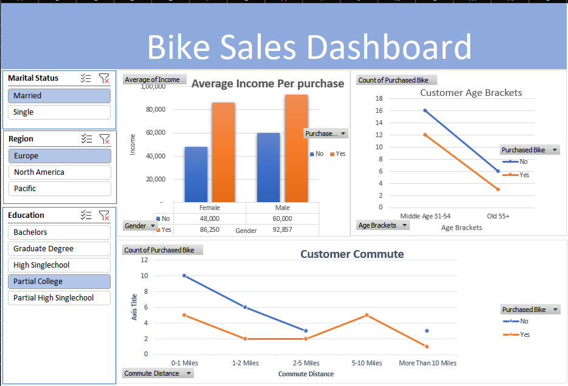

# 📊bike sales analysis using excel

---

## 📑 Table of Contents

1. [📊 Project Overview](#-project-overview)
2. [🎯 Objectives](#-objectives)
3. [🗂 Dataset Information](#-dataset-information)
4. [🧹 Data Cleaning Process](#-data-cleaning-process)
5. [📈 Dashboard Features](#-dashboard-features)
6. [📊Pivot Table Analysis](#pivot-table-analysis)
7. [💡 Key Insights](#-key-insights)
8. [🖼 Project Screenshots](#-project-screenshots)
9. [📌 Conclusion](#-conclusion)
10. [🚀 Future Improvements](#-future-improvements)
11. [👤 Author](#-author)

---

## 📊 Project Overview

This project presents a comprehensive **Sales Analysis Dashboard** built using Microsoft Excel.  
The goal of this project is to analyze sales performance, identify business trends, and generate actionable insights using data visualization techniques.

The dashboard provides a clear view of total sales, profit performance, regional trends, and product-level analysis.  
By leveraging Excel tools such as Pivot Tables, Charts, and Slicers, the project transforms raw sales data into meaningful business intelligence for better decision-making.

---

## 🎯 Objectives

The primary objectives of this Sales Analysis project are:

- 📌 Analyze overall sales and profit performance across different regions.
- 📈 Identify top-performing and underperforming products.
- 📅 Evaluate monthly and yearly sales trends.
- 🌍 Measure region-wise and category-wise contribution to total revenue.
- 💰 Identify profit margins and detect potential loss areas.
- 📊 Create an interactive dashboard for better business decision-making.
- 🔍 Transform raw sales data into meaningful visual insights using Excel tools.
---
## 🗂 Dataset Information

The dataset used in this project contains customer demographic and purchasing behavior data related to bike purchases.

### 📌 Dataset Details:

- 📄 Total Records: 1026 rows  
- 📊 Total Columns: 13 columns  
- 🌍 Regions Included: North America, Europe, Pacific  
- 🎯 Target Variable: Purchased Bike (Yes/No)  

###  Key Columns in Dataset:

- ID – Unique customer identifier  
- Marital Status – Married / Single  
- Gender – Male / Female  
- Income – Annual income of customer  
- Children – Number of children  
- Education – Education level  
- Occupation – Type of job  
- Home Owner – Yes / No  
- Cars – Number of cars owned  
- Commute Distance – Distance to workplace  
- Region – Customer region  
- Age – Customer age  
- Purchased Bike – Purchase decision (Target Variable)

### Dataset Summary:

- 👥 Average Age: 44 years  
- 💰 Average Income: $56,208  
- 👨‍👩‍👧 Average Children: 2  
- 🚗 Average Cars Owned: 1  

This dataset enables analysis of customer demographics and identification of factors influencing bike purchase decisions.

---

### 📈 Dashboard Features

An interactive Excel dashboard that analyzes bike sales data to uncover customer purchasing behavior and demographic trends.

The Bike Buyers Analysis Dashboard provides an interactive visual summary of customer demographics and purchasing behavior.

## Key Dashboard Highlights:

-  Total Customers Overview – Displays total number of customers analyzed.
-  Purchase Distribution – Shows comparison between customers who purchased bikes and those who did not.
- Demographic Analysis – Breakdown by Age, Gender, Marital Status, and Education level.
-  Income Analysis – Comparison of income levels between buyers and non-buyers.
- Regional Performance – Purchase behavior segmented by region (North America, Europe, Pacific).
-  Lifestyle Factors – Analysis based on number of cars owned and commute distance.
- Interactive Filters – Slicers allow dynamic filtering by gender, region, marital status, and other categories.

## Dashboard Purpose

The dashboard transforms raw customer data into visual insights, enabling easy identification of trends and key purchase-driving factors.  
It supports data-driven decision-making by highlighting demographic patterns and behavioral differences between buyers and non-buyers.

---
## 💡 Key Insights

Based on the data analysis, the following key insights were identified:

-  Customers aged between 30–50 years are more likely to purchase bikes compared to other age groups.

-  Higher-income customers show a greater probability of purchasing bikes.

-  Male customers slightly dominate bike purchases compared to female customers.

-  Customers with fewer children tend to purchase bikes more frequently.

-  Customers owning fewer cars are more likely to buy bikes, indicating bikes may be used as an alternative mode of transportation.

-  Homeowners show a higher purchase rate compared to non-homeowners.

-  Customers from North America region have a comparatively higher purchase rate than other regions.

-  Education and occupation also influence buying behavior, with professionals and graduates showing higher purchase interest.
-   **Interactive Slicers**
  - Marital Status (Married / Single)
  - Region (Europe, North America, Pacific)
  - Education Level (Bachelors, Graduate Degree, High School, Partial College, Partial High School)

- **Average Income per Purchase**
  - Compares income of customers who purchased vs. did not purchase bikes
  - Gender-based income insights

- **Customer Age Analysis**
  - Purchase trends across age brackets (31–54, 55+)
  - Identifies high-conversion age segments

- **Customer Commute Analysis**
  - Purchase behavior based on commute distance
  - Helps understand lifestyle impact on buying decisions

##  Business Insights

- Identifies high-income customer segments
- Highlights demographic influence on sales
- Supports targeted marketing strategies
- Enables dynamic filtering for real-time analysis

---
## 📌 Conclusion

This project successfully analyzes customer demographic data to understand the key factors influencing bike purchase decisions. 

Through data cleaning, pivot table analysis, and interactive dashboard creation in Microsoft Excel, meaningful patterns were identified related to age, income, region, and lifestyle factors.

The analysis highlights that income level, age group, number of cars owned, and region play a significant role in determining customer purchase behavior. 

Overall, this project demonstrates how Excel can be effectively used as a powerful data analysis and business intelligence tool to transform raw data into actionable insights.

---

## 🚀 Future Improvements

To further enhance this project, the following improvements can be implemented:

- Automate data cleaning and reporting using Excel VBA or Macros.
- Integrate the dataset with Power BI for advanced visualization and storytelling.
- Apply predictive analysis techniques to forecast customer purchase behavior.
- Implement basic statistical analysis to identify stronger correlations.
- Connect Excel with a live database (SQL) for real-time data updates.
- Improve dashboard design with advanced charts and interactive elements.
---
## 👤 Author 

**Gajanan M Naik**  
Aspiring Data Analyst  

  - 📧 Email: [naikgajanan238@gmail.com](mailto:naikgajanan238@gmail.com)
  - 💼 LinkedIn:[https://www.linkedin.com/in/gajanan-naik-4a8a08373/](https://www.linkedin.com/in/gajanan-naik-4a8a08373/)
  - 🐙 GitHub: [https://github.com/Gajanannaik007](https://github.com/Gajanannaik007)

---

